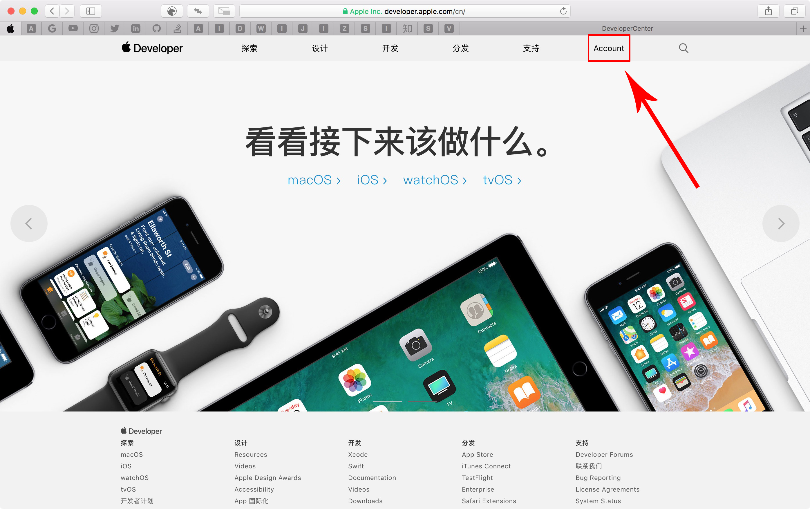
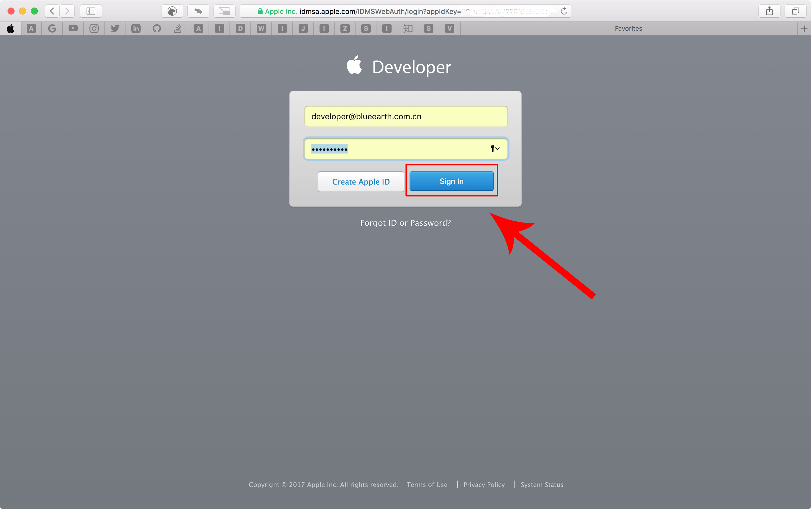
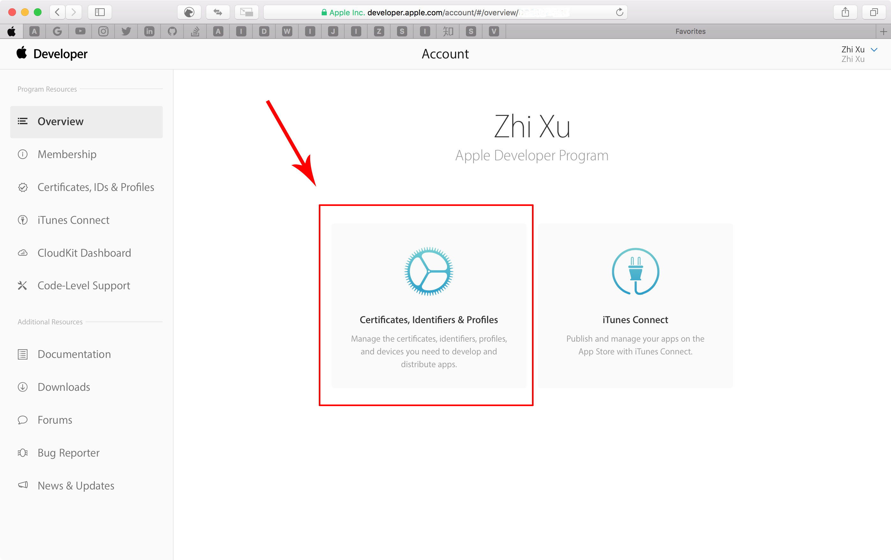

# AppStore创建以及更新应用说明文档

## 1.配置AppID

## 1.1 登录[苹果开发者中心](https://developer.apple.com/cn/)

在浏览器中输入https://developer.apple.com/cn/ 打开苹果开发者中心页面

点击`Account`进入登录页面

输入苹果开发者账号密码并店家`Sign In`登录,进入Account界面

点击`Certificates,Identifiers & Profiles`进入证书配置界面
