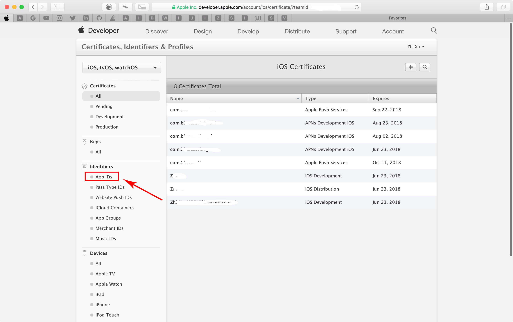

# AppStore创建以及更新应用说明文档

## 1.配置AppID

## 1.1 登录[苹果开发者中心](https://developer.apple.com/cn/)

:one: 在浏览器中输入https://developer.apple.com/cn/ 打开苹果开发者中心页面

:two: 点击`Account`进入登录页面

:three: 输入苹果开发者账号密码并点击`Sign In`登录,进入Account界面.

如果没有苹果开发者账号,点击`Create Apple ID`进行申请.这里不错阐述,自行查阅文档.

:four: 点击`Certificates,Identifiers & Profiles`进入证书配置界面.

## 1.2 配置AppID
:one: 点击左侧`Identifiers`下的`App IDs`

:two: 然后点击右上角的`+`号

:three: 填入以下必要的一些信息

| 项目 | 节点 | 说明 |
|---|---|---|
|App ID Description|Name|

