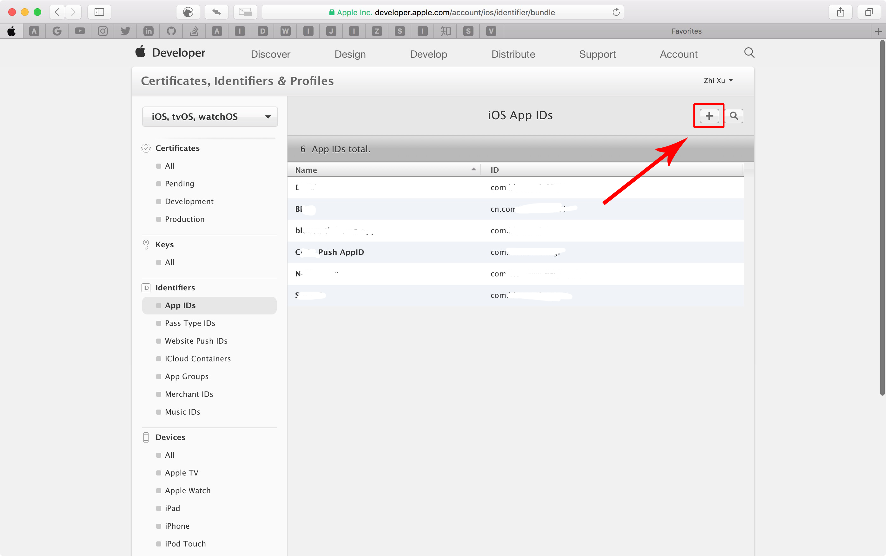
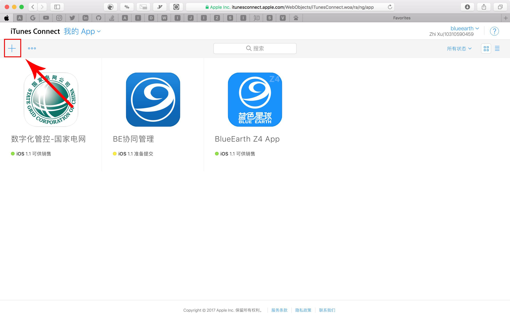
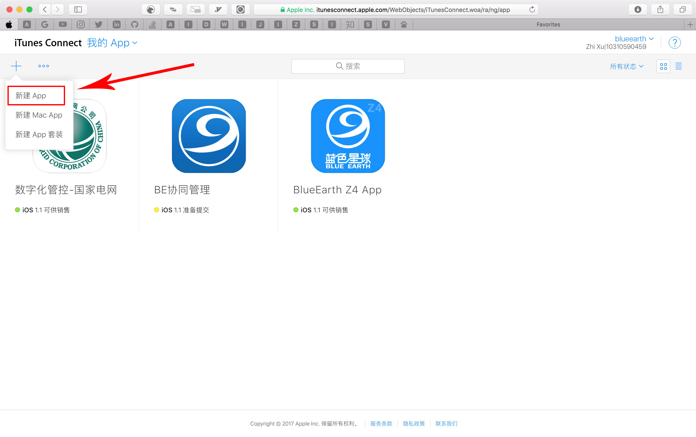

# AppStore创建以及更新应用说明文档

## 1.配置AppID

### 1.1 登录[苹果开发者中心](https://developer.apple.com/cn/)

:one: 在浏览器中输入https://developer.apple.com/cn/ 打开苹果开发者中心页面

:two: 点击`Account`进入登录页面

:three: 输入苹果开发者账号密码并点击`Sign In`登录,进入Account界面.

如果没有苹果开发者账号,点击`Create Apple ID`进行申请.这里不错阐述,自行查阅文档.

:four: 点击`Certificates,Identifiers & Profiles`进入证书配置界面.

### 1.2 配置AppID
:one: 点击左侧`Identifiers`下的`App IDs`

:two: 然后点击右上角的`+`号

:three: 填入以下必要的一些信息

| 节点 | 字段 | 说明 |
|---|---|---|
|`App ID Description`|`Name`|AppID的名称,仅支持英文|
|`APP ID Suffix`|选择`Explicit App ID`|这里的`Bundle ID`要和`Xcode`里的一致.以域名反写形式填入,例如`com.blueearth.sgcoc`|
|`App Services`|`Push Notifications`|如果应用有推送功能,一般需要勾选该功能|

:four: 所有信息填写完成之后,点击页面下方`continue`按钮进入到下一级页面点击`register`并继续点击`Done`.到此为止,我们的`App ID`已经配置成功.

## 2.在`iTunes Connect`中新建应用

### 2.1 进入开发者app管理页面
:one: 我们可以直接在浏览器中输入 https://itunesconnect.apple.com/login 进入到`iTunes Connect`登录界面

:two: 输入我们的苹果开发者账号,并敲击`Enter`键进行登录,进入开发者主页

:three:点击`我的App`进入开发者app管理页面

### 2.2 新建App Store应用
:one: 点击左上角`+`号

:two: 在弹出的窗口中选择`新建App`进入配置页面

:three: 配置App所需项.
* 平台选择`iOS`
* 名称填入应用名称,该名称即`App Store`应用展示以及搜索名称
* 主要语言可以不选
* 套装ID这里我们选择前面创建的AppID
* SKU为App专有的ID,此ID不会在`App Store`中显示。以应用名称英文缩写即可.

以上所有填写成功后,创建按钮会变亮,点击`创建`完成应用的创建.
