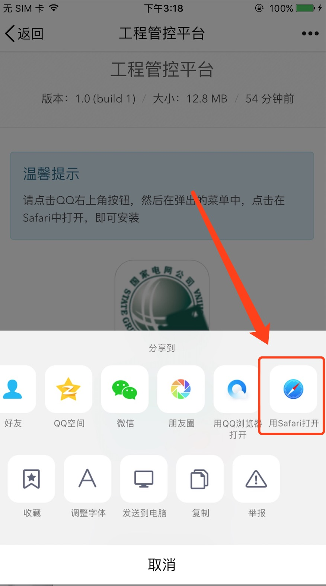
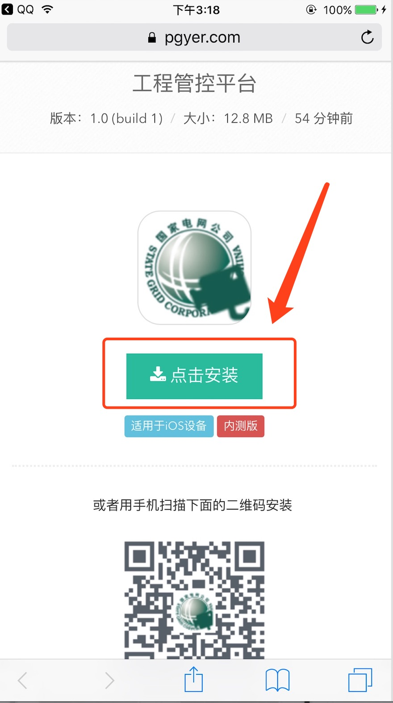
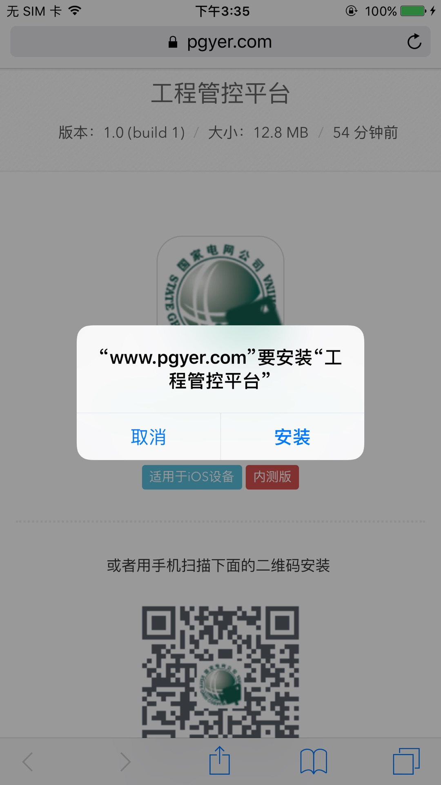
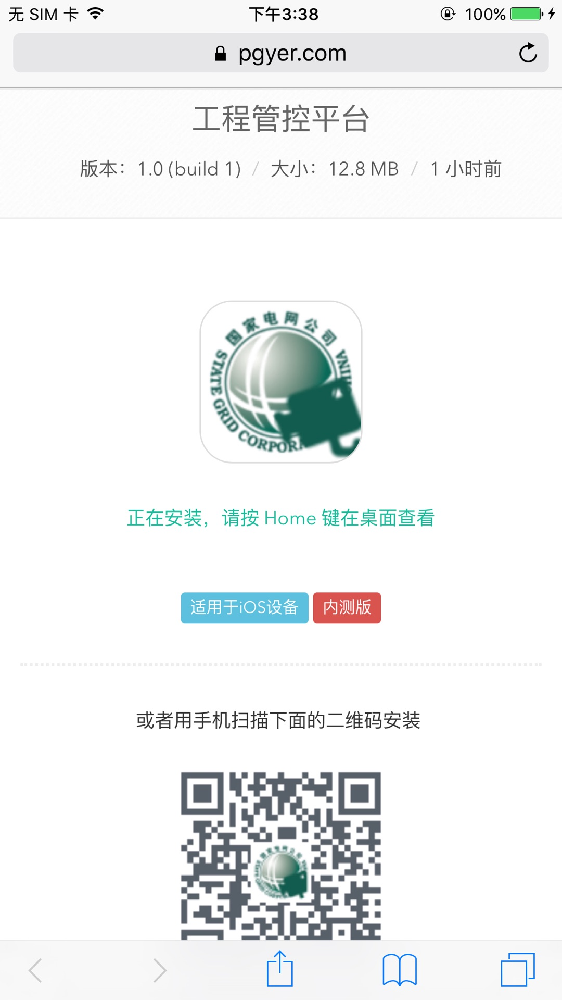
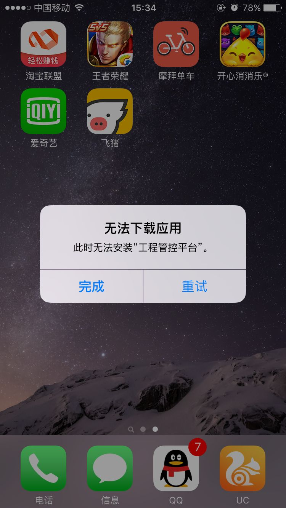
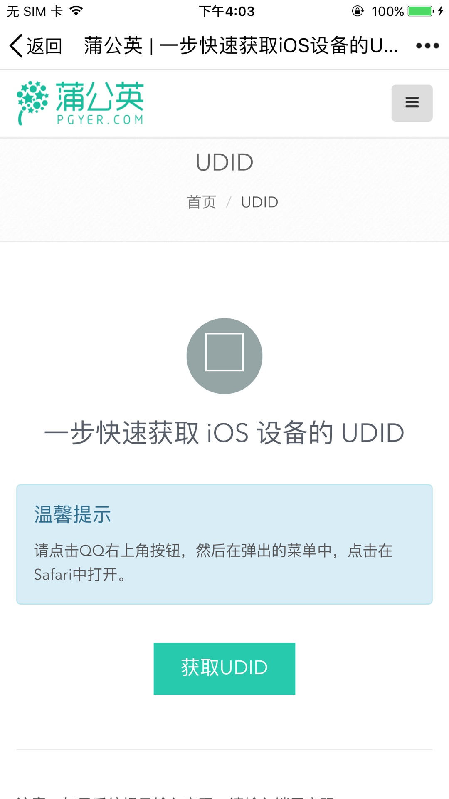
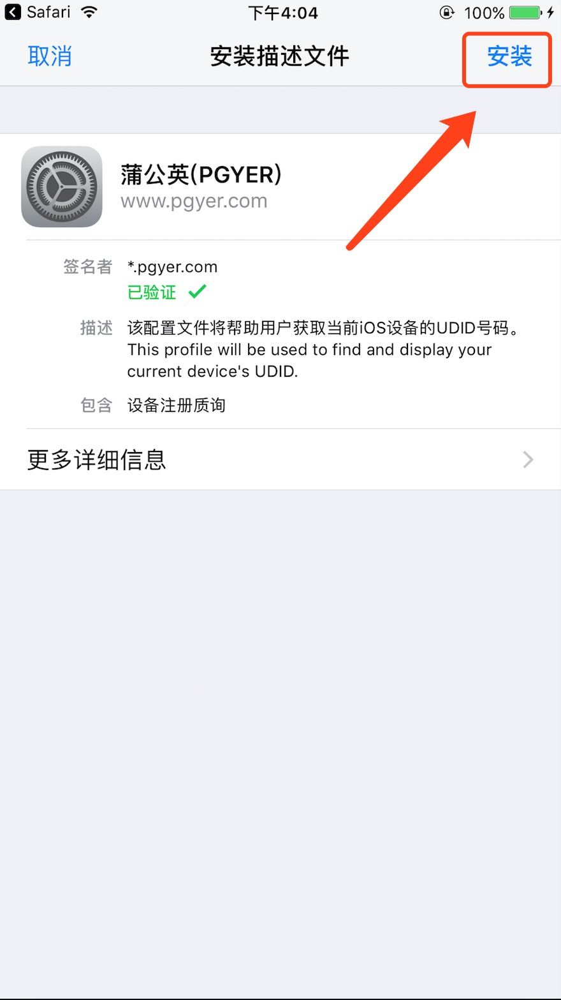
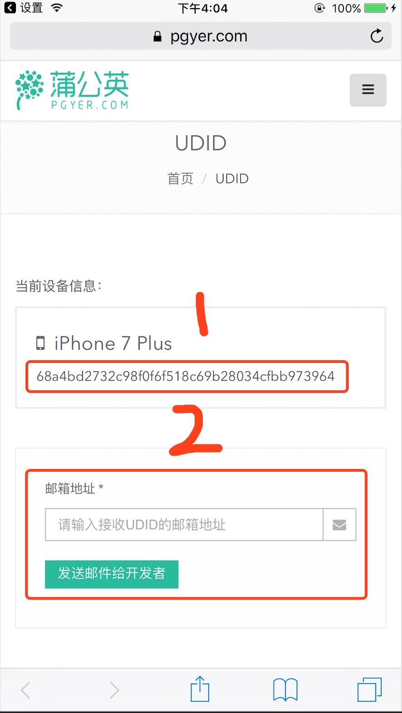

我们公司现已将苹果程序托管至蒲公英平台.

应用更新功能将通过蒲公英进行更新.

# 更新应用
## 1.更新扫描以下二维码

* 

## 2.点击右上角图标,选择用Safari打开

* 
* 

## 3.点击安装,在弹出的选择框中,选择安装

* 
* 

## 4.安装完成
当提示”正在安装,请按Home键在桌面查看”时,安装以及完成.

* 

# 安装错误
说明:

如果您是第一次安装我们的应用,您会遇到以下的错误提示.无法下载应用.

* 

这是因为您需要向我们注册您手机的`UDID`,才可以使用程序

请按照以下步骤解决.

## 1.关于获取iPhone手机的UDID
扫描以下二维码,出现蒲公英`UDID`网页,同样,用safari打开

* 

## 2.点击获取UDID

* 

## 3.在弹出的窗口中,点击右上角安装

* 

## 4.你可以使用以下两种方式将您手机的`UDID`提交给我们的开发者进行注册.
* 
* (1)直接复制您的`UDID`(上图中1的位置),并发送给我们的开发人员.
* (2)在2区域输入我们开发者的邮箱,并点击发送邮件给开发者

## 5.稍等片刻,待我们的开发者将您的设备注册后,并反馈给您时,您可以按照前面更新应用的步骤进行更新
