# AppStore创建以及更新应用说明文档

## 1.配置AppID

### 1.1 登录[苹果开发者中心](https://developer.apple.com/cn/)

:one: 在浏览器中输入https://developer.apple.com/cn/ 打开苹果开发者中心页面

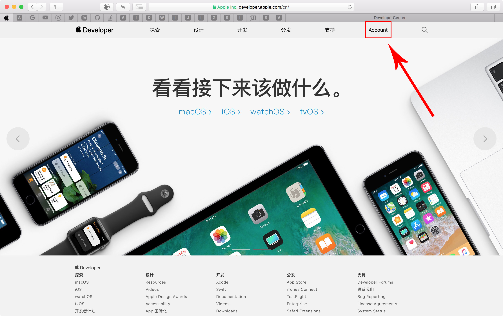

:two: 点击`Account`进入登录页面

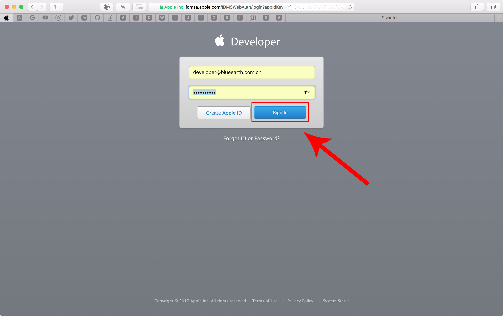

:three: 输入苹果开发者账号密码并点击`Sign In`登录,进入Account界面.

如果没有苹果开发者账号,点击`Create Apple ID`进行申请.这里不作阐述,自行查阅文档.

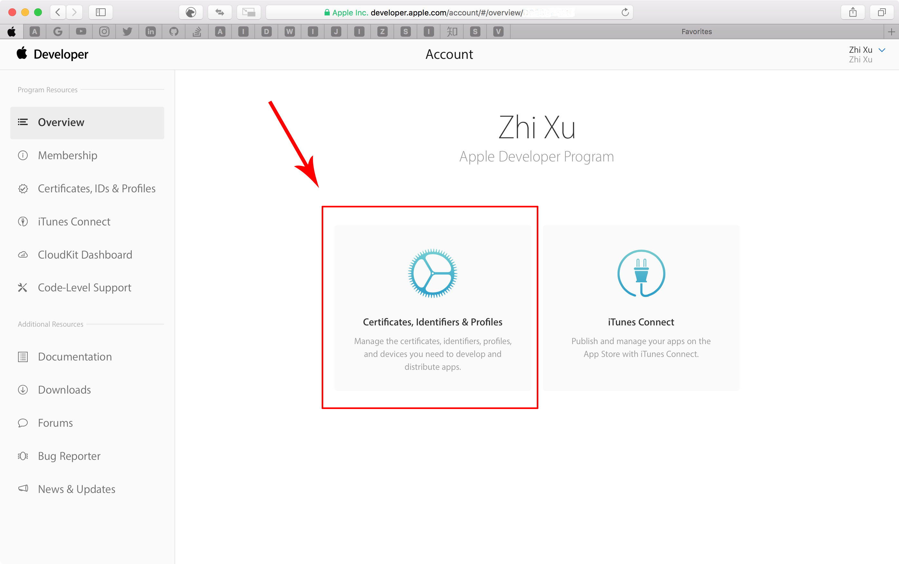

:four: 点击`Certificates,Identifiers & Profiles`进入证书配置界面.

### 1.2 配置AppID
:one: 点击左侧`Identifiers`下的`App IDs`

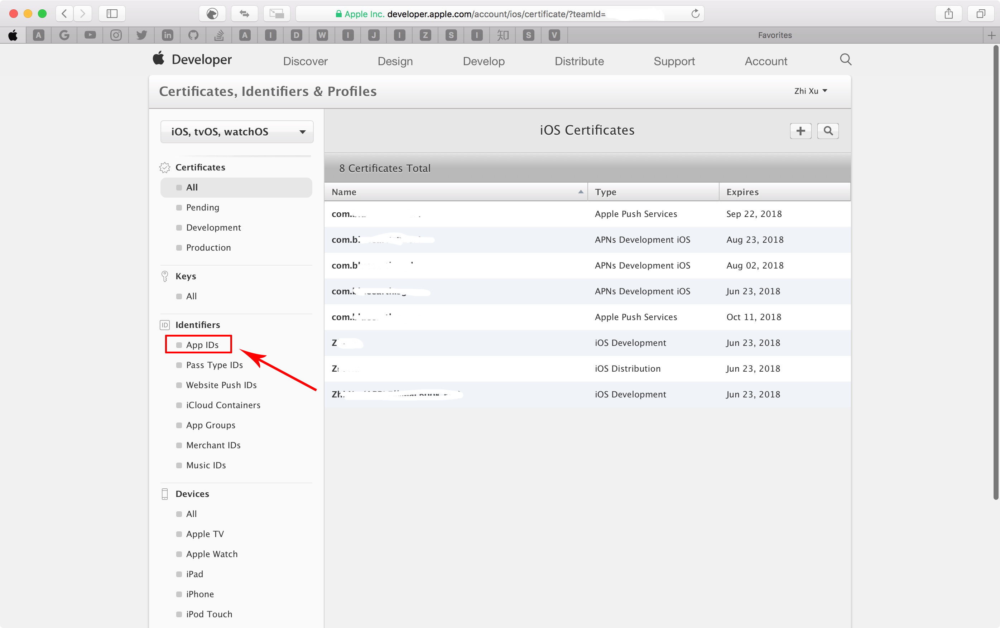

:two: 然后点击右上角的`+`号

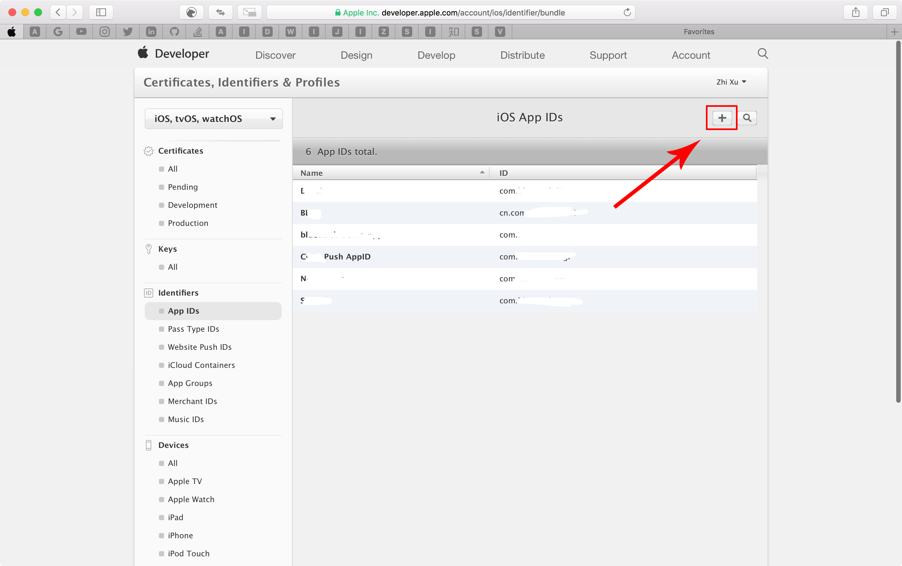

:three: 填入以下必要的一些信息

| 节点 | 字段 | 说明 |
|---|---|---|
|`App ID Description`|`Name`|AppID的名称,仅支持英文|
|`APP ID Suffix`|选择`Explicit App ID`|这里的`Bundle ID`要和`Xcode`里的一致.以域名反写形式填入,例如`com.blueearth.sgcoc`|
|`App Services`|`Push Notifications`|如果应用有推送功能,一般需要勾选该功能|

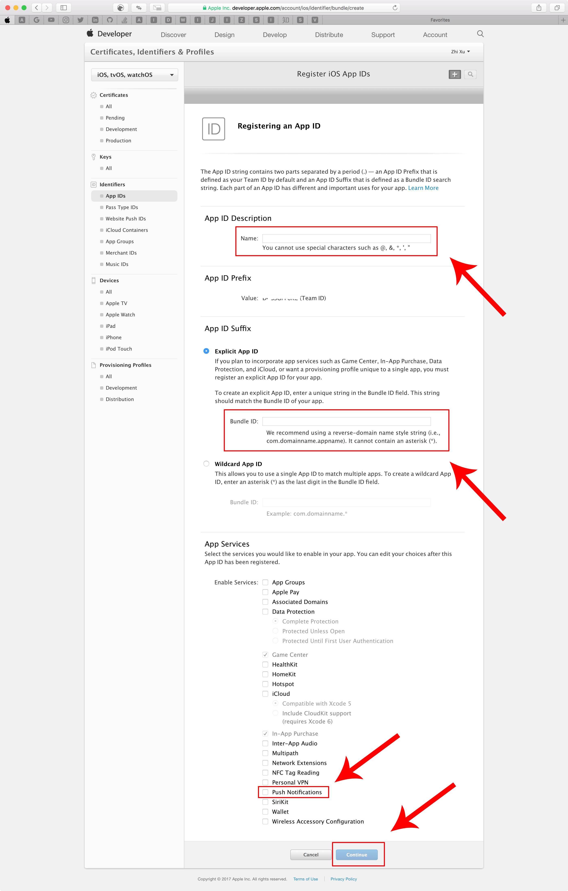

:four: 所有信息填写完成之后,点击页面下方`continue`按钮进入到下一级页面点击`register`并继续点击`Done`.到此为止,我们的`App ID`已经配置成功.

## 2.在`iTunes Connect`中新建应用

### 2.1 进入开发者app管理页面
:one: 我们可以直接在浏览器中输入 https://itunesconnect.apple.com/login 进入到`iTunes Connect`登录界面

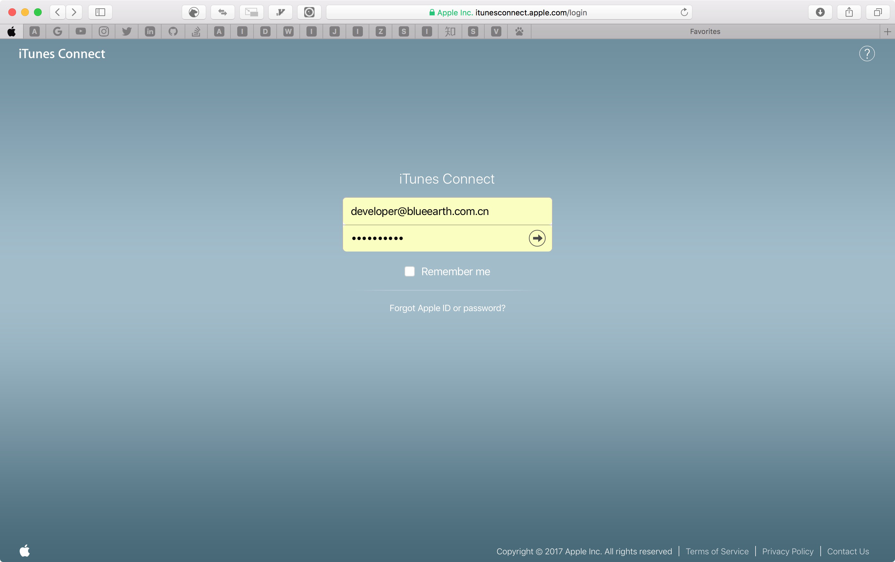

:two: 输入我们的苹果开发者账号,并敲击`Enter`键进行登录,进入开发者主页

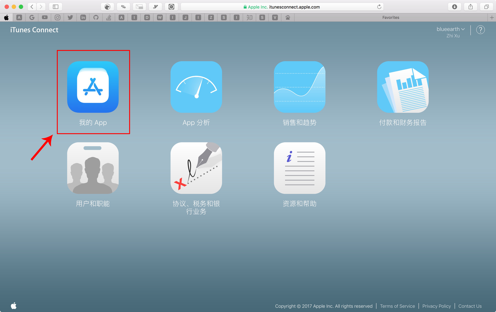

:three:点击`我的App`进入开发者app管理页面

### 2.2 新建App Store应用
:one: 点击左上角`+`号

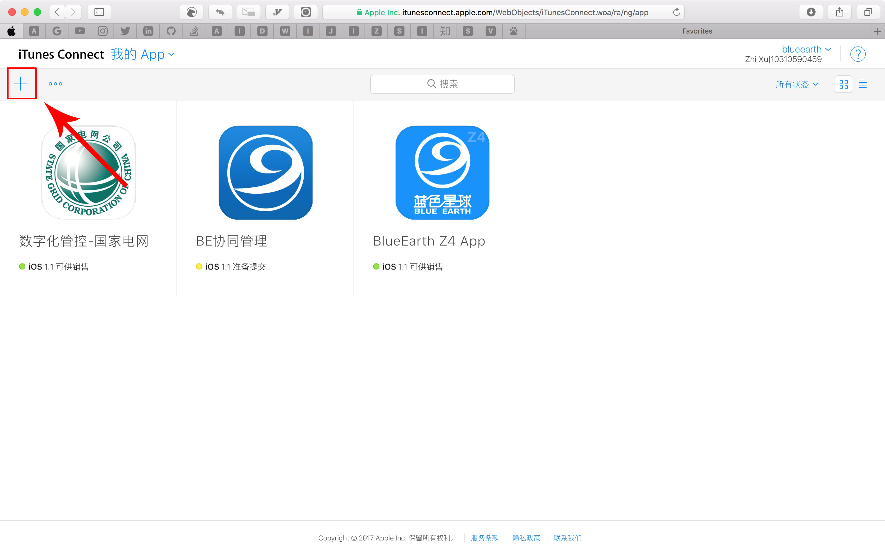

:two: 在弹出的窗口中选择`新建App`进入配置页面

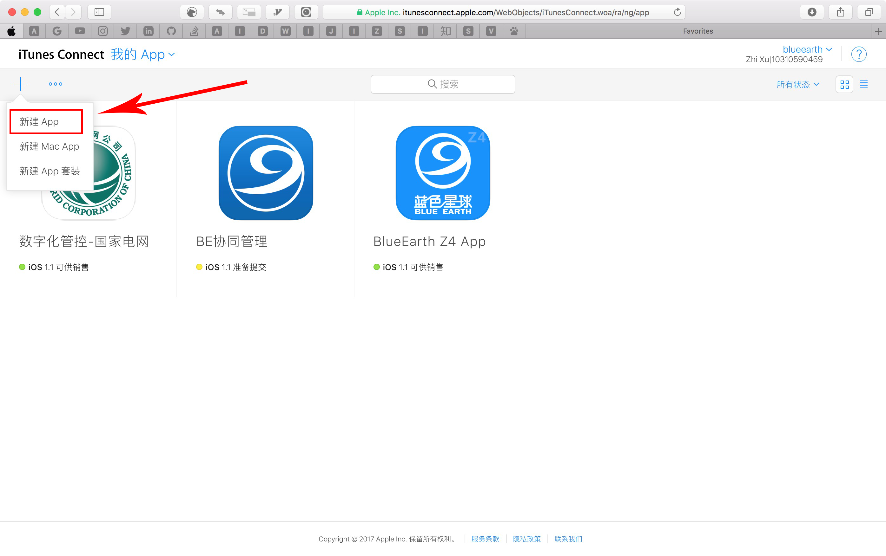

:three: 配置App所需项.
* 平台选择`iOS`
* 名称填入应用名称,该名称即`App Store`应用展示以及搜索名称
* 主要语言可以不选
* 套装ID这里我们选择前面创建的AppID
* SKU为App专有的ID,此ID不会在`App Store`中显示。以应用名称英文缩写即可.

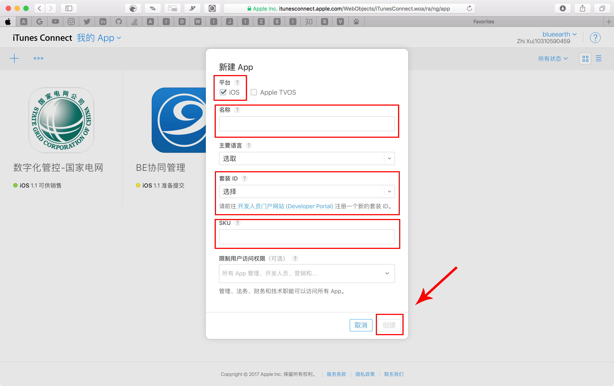

以上所有填写成功后,创建按钮会变亮,点击`创建`完成应用的创建.

## 3.配置App信息

以上应用创建好后,我们就能在App中心看见我们新建的应用.这里我们以《BE协同管理》这个App为例讲解如何配置App后续的信息.

:one:点击《BE协同管理》应用进入该应用的配置界面

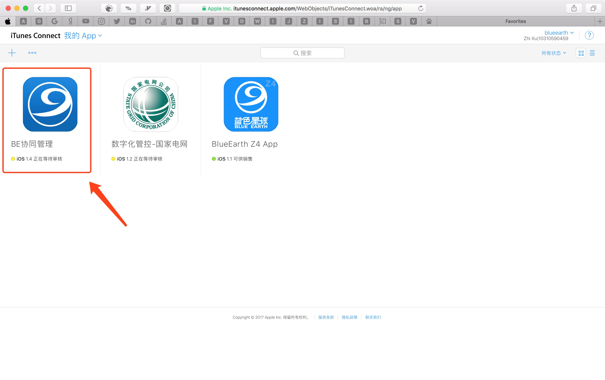

:two:点击左侧的菜单`App信息`配置App Store基础信息.第一次创建应用时以下4个信息必须要配置,其他可选,根据需要填写.

* 名称 : 该项即为 `App Store` 显示的应用名称
* 主要语言 : 为 App 开发所使用的语言,作为中国用户使用,建议添写 `简体中文`
* 类别 : 为`App Store` 对应用的分类依据,根据应用实际类型填写
* 分级 : 为应用的可使用人员年龄范围,如图中的`4+岁`,表示4岁以上用户可用.

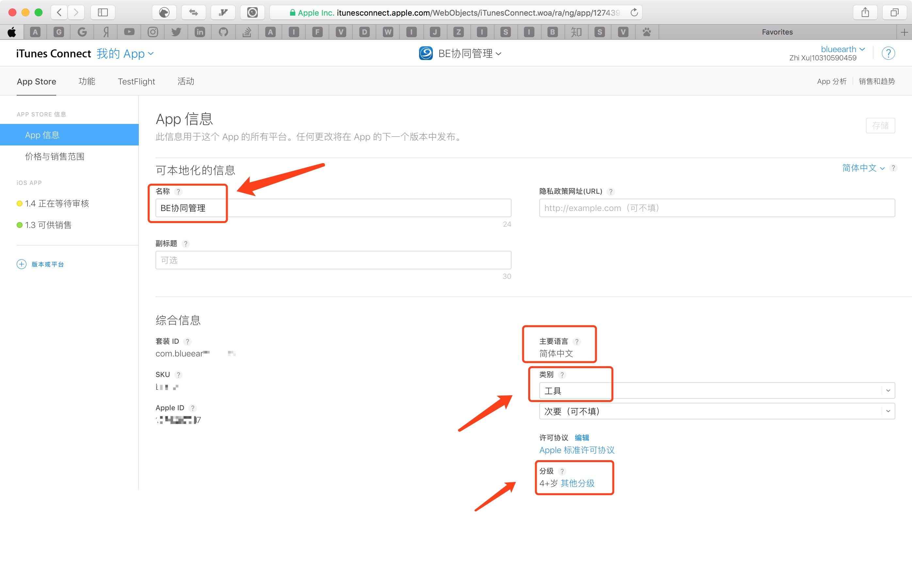

:three:点击左侧菜单`价格与销售范围`配置应用的价格信息.以下2项必填.其他可以不用修改,使用默认配置.

* 价格 : 根据应用需要选择应用的销售价格
* 销售范围 : 根据应用需要投入的国家选择.如果只是中国用户使用,建议只勾选中国,这样有助于审核更快地通过.

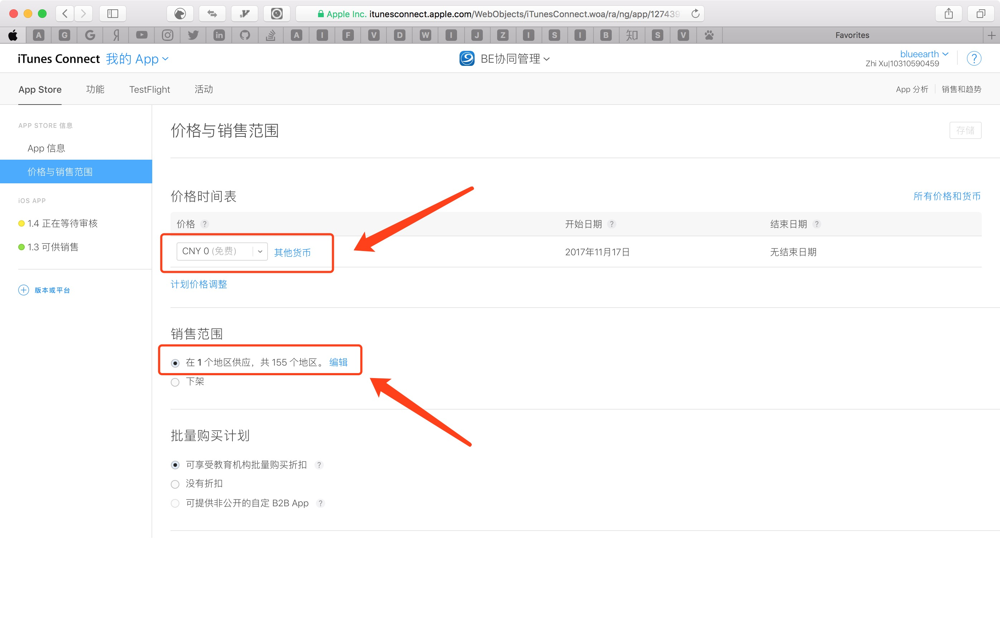

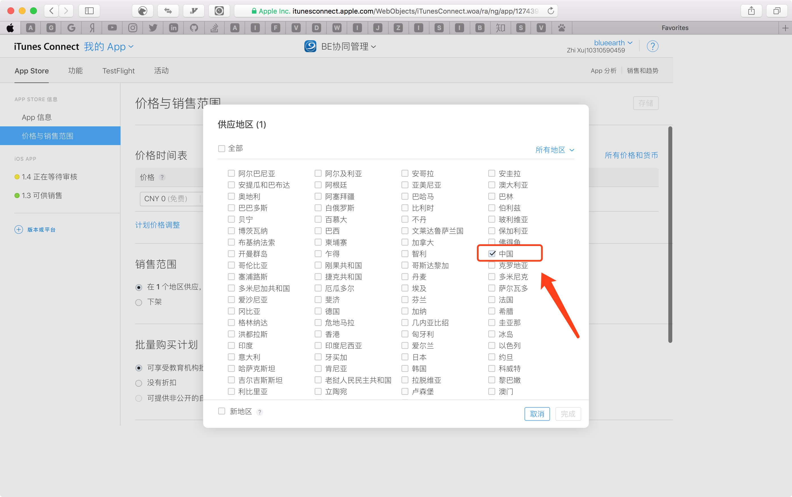

## 4.配置版本信息
第一次新建应用,我们会在左侧`iOS APP`灰色菜单下看见 黄色圆点标记的 `1.0准备提交`.点击后进行配置版本信息.

:one:版本配置,以下图片中所有红色框为必填项,蓝色框为可选项,但是建议填写

* 此版本的新增内容 - 该项为每次提交新版的时候填写的更新信息.
* App预览和屏幕快照 - 为AppStore中以图片形式简单展示应用主要功能界面,一般最多上传5张图片,具体的图片大小格式参考文档最后的<表-App预览图片尺寸>
* 关键词 - 关键词为用户通过APPStore搜索应用的关键词.建议多写几个关键词,以逗号隔开
* 技术支持网址 - 建议填写,该项可以在AppStore链接
* 描述 - 应用的大致功能等描述信息
* 构建版本 - 这里在未上传ipa包的时候,会有一个 :heavy_plus_sign: 号,上传完应用ipa包后去勾选.
* App综合信息 - 这里填写公司/开发人员版权/地址等信息
* App审核信息 - 这里信息的填写有助于提高审核通过
  * 联系信息 - 这里一般填写开发人员信息,以备苹果审核人员联系
  * 需要登录 - 如果app入口页面必须登录才能进入,请提供测试账号
  * 备注 - 这里可以填写一些可能导致审核不通过时的一些说明.
* 版本发布 - 可以默认选择`自动发布此版本`,也可以根据需求选择其他.
* 自动更新的分阶段发布 - 默认
* 重设iOS评分 - 默认

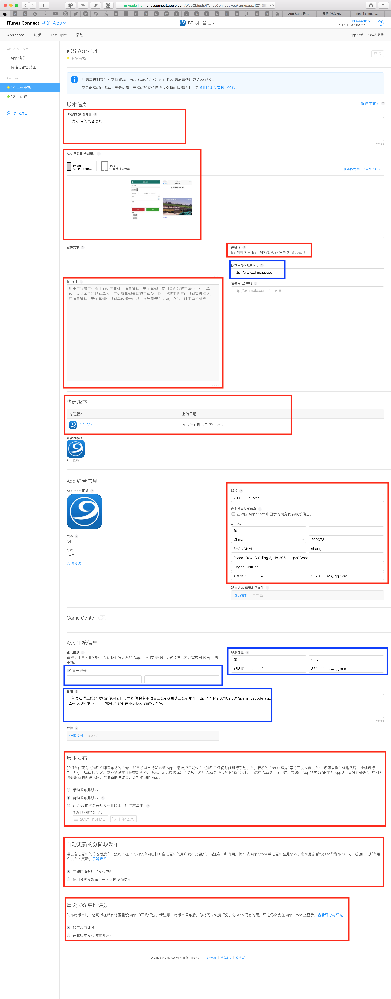

:two: 以上所有信息填好后,点击右上角存储,提交审核.弹出页面所有广告选项都选择否即可.

## 附录

### 表-App预览图片尺寸
<table data-type="Custom" aria-label="屏幕快照规范"><thead><tr><th colspan="3" scope="col">
设备尺寸或平台
</th><th colspan="6" scope="col">
屏幕快照尺寸
</th><th colspan="3" scope="col">
必填项
</th></tr></thead><tbody><tr><td colspan="3">
5.8 英寸 Retina 显示屏
</td><td colspan="6">
纵向分辨率为 1125 x 2436 像素

横向分辨率为 2436 x 1125 像素
</td><td colspan="3">
可选
</td></tr><tr><td colspan="3">
5.5 英寸 Retina 显示屏
</td><td colspan="6">
纵向分辨率为 1242 x 2208 像素

横向分辨率为 2208 x 1242 像素
</td><td colspan="3">
如 App 在 iPhone 上运行，则此项为必填
</td></tr><tr><td colspan="3">
4.7 英寸 Retina 显示屏
</td><td colspan="6">
纵向分辨率为 750 x 1334 像素

横向分辨率为 1334 x 750 像素
</td><td colspan="3">
可能使用 5.5 英寸显示屏
</td></tr><tr><td colspan="3">
4 英寸 Retina 显示屏
</td><td colspan="6">
纵向分辨率（不含状态栏）为 640 x 1096 像素

纵向分辨率（全屏）为 640 x 1136 像素

横向分辨率（不含状态栏）为 1136 x 600 像素

横向分辨率（全屏）为 1136 x 640 像素
</td><td colspan="3">
可能使用 5.5 英寸或 4.7 英寸显示屏
</td></tr><tr><td colspan="3">
3.5 英寸 Retina 显示屏
</td><td colspan="6">
纵向分辨率（不含状态栏）为 640 x 920 像素

纵向分辨率（全屏）为 640 x 960 像素

横向分辨率（不含状态栏）为 960 x 600 像素

横向分辨率（全屏）为 960 x 640 像素
</td><td colspan="3">
可能使用 5.5 英寸、4.7 英寸或 4 英寸显示屏
</td></tr><tr><td colspan="3">
12.9 英寸 Retina 显示屏
</td><td colspan="6">
纵向分辨率为 2048 x 2732 像素

横向分辨率为 2732 x 2048 像素
</td><td colspan="3">
如 App 在 iPad 上运行，则此项为必填
</td></tr><tr><td colspan="3">
9.7 英寸 Retina 显示屏
</td><td colspan="6">
高分辨率：

横向分辨率（不含状态栏）为 2048 x 1496 像素

横向分辨率（全屏）为 2048 x 1536 像素

纵向分辨率（不含状态栏）为 1536 x 2008 像素

纵向分辨率（全屏）为 1536 x 2048 像素

段落

标准分辨率：

横向分辨率（不含状态栏）为 1024 x 748 像素

横向分辨率（全屏）为 1024 x 768 像素

纵向分辨率（不含状态栏）为 768 x 1004 像素

纵向分辨率（全屏）为 768 x 1024 像素
</td><td colspan="3">
可以使用 10.5 或 12.9 英寸显示屏
</td>
</tbody>
</table>
